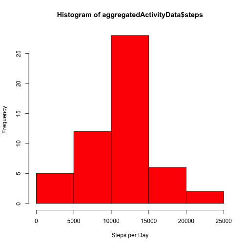
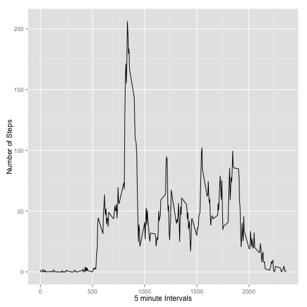
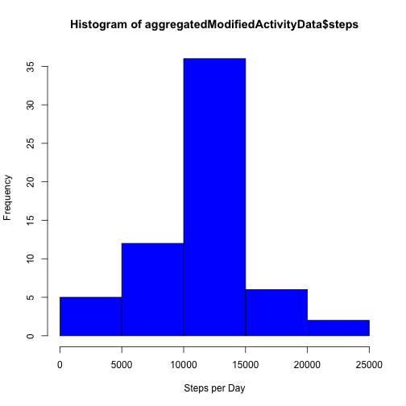
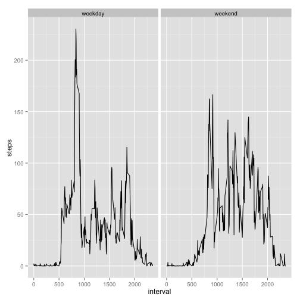

# Reproducible Research: Peer Assessment 1 by *Partha Majumdar*
Date Started: 10Jun2014 2:24 PM

Date Ended:

Machine used: Apple iMac

Description: 

## Loading and preprocessing the data
As the file is a comma separated file, we use the function "read.csv" to read the data. The data is loaded in the variable "**activityData**". It is assumed that the file **activity.csv** as provided in the assignment is present in the current working directory.

```r
activityData <- read.csv("activity.csv", sep=",", colClasses=c("numeric", "Date", "numeric"), na.string="NA")
totalNumberOfRowsInData <- nrow(activityData)
```

The data contains **3** columns - **steps, date, interval**. We do an initial inspection of the data using the head() and tail() function.

```r
head(activityData)
```

```
##   steps       date interval
## 1    NA 2012-10-01        0
## 2    NA 2012-10-01        5
## 3    NA 2012-10-01       10
## 4    NA 2012-10-01       15
## 5    NA 2012-10-01       20
## 6    NA 2012-10-01       25
```

```r
tail(activityData)
```

```
##       steps       date interval
## 17563    NA 2012-11-30     2330
## 17564    NA 2012-11-30     2335
## 17565    NA 2012-11-30     2340
## 17566    NA 2012-11-30     2345
## 17567    NA 2012-11-30     2350
## 17568    NA 2012-11-30     2355
```

On inspection (by opening the file using TextEdit) and from the above result, I notice that some data contains "NA". So, first activity we conduct is to remove all the rows of data containing any missing or invalid values. We store the cleaned data in the variable "**goodActivityData**".

```r
goodActivityData <- subset(activityData, !is.na(steps) & !is.na(date) & !is.na(interval))
numberOfCleanRowsOfData <- nrow(goodActivityData)
```

The number of rows in the original dataset = **17568**.

The number of rows in the dataset after cleaning = **15264**.

The number of rows in the dataset with invalid data = **2304**.


## What is mean total number of steps taken per day?
To find the *"mean total number of steps per day"*, we first find the *"total number of steps per day"*. Let us denote *"mean total number of steps per day"* by **"mu"** and let us denote *"total number of steps per day"* by **"t<date>"**.

To determine **t<date>**, we use the *aggregate()* function.

```r
aggregatedActivityData <- aggregate(steps ~ date, goodActivityData, sum)
```

The aggregated data looks as follows.

```r
aggregatedActivityData
```

```
##          date steps
## 1  2012-10-02   126
## 2  2012-10-03 11352
## 3  2012-10-04 12116
## 4  2012-10-05 13294
## 5  2012-10-06 15420
## 6  2012-10-07 11015
## 7  2012-10-09 12811
## 8  2012-10-10  9900
## 9  2012-10-11 10304
## 10 2012-10-12 17382
## 11 2012-10-13 12426
## 12 2012-10-14 15098
## 13 2012-10-15 10139
## 14 2012-10-16 15084
## 15 2012-10-17 13452
## 16 2012-10-18 10056
## 17 2012-10-19 11829
## 18 2012-10-20 10395
## 19 2012-10-21  8821
## 20 2012-10-22 13460
## 21 2012-10-23  8918
## 22 2012-10-24  8355
## 23 2012-10-25  2492
## 24 2012-10-26  6778
## 25 2012-10-27 10119
## 26 2012-10-28 11458
## 27 2012-10-29  5018
## 28 2012-10-30  9819
## 29 2012-10-31 15414
## 30 2012-11-02 10600
## 31 2012-11-03 10571
## 32 2012-11-05 10439
## 33 2012-11-06  8334
## 34 2012-11-07 12883
## 35 2012-11-08  3219
## 36 2012-11-11 12608
## 37 2012-11-12 10765
## 38 2012-11-13  7336
## 39 2012-11-15    41
## 40 2012-11-16  5441
## 41 2012-11-17 14339
## 42 2012-11-18 15110
## 43 2012-11-19  8841
## 44 2012-11-20  4472
## 45 2012-11-21 12787
## 46 2012-11-22 20427
## 47 2012-11-23 21194
## 48 2012-11-24 14478
## 49 2012-11-25 11834
## 50 2012-11-26 11162
## 51 2012-11-27 13646
## 52 2012-11-28 10183
## 53 2012-11-29  7047
```

Now, we find the value of **mu** using the function *mean()*. The syntax is as follows - *mean(aggregatedActivityData$steps)*.

The value of **mu** is **1.0766 &times; 10<sup>4</sup>**.

The value of the **median** is **1.0765 &times; 10<sup>4</sup>**. The median is determined using the *median()* function using the following syntax - *median(aggregatedActivityData$steps)*.

The histogram for the above data is shown below.

```r
hist(aggregatedActivityData$steps, col="Red", xlab="Steps per Day")
```

 

Mean (mu) = 1.0766 &times; 10<sup>4</sup>

Median = 1.0765 &times; 10<sup>4</sup>

Standard Deviation = 4269.1805


## What is the average daily activity pattern?
As in the last step, to determine *"average daily activity pattern"*, we first find the *"total daily activity pattern"*. To determine the *"total daily activity pattern"*, we use the *aggregate()* function to average the **steps** for **each interval**.

```r
activityPattern <- aggregate(steps ~ interval, goodActivityData, mean)
```

This data has **288** rows.

The Time-Series plot for the above data is provided below.

```r
library("ggplot2")
qplot(interval, steps, data=activityPattern, geom=c("line"), xlab="5 minute Intervals", ylab="Number of Steps")
```

 

Determine the row which contains the maximum number of steps for an interval.

```r
maximumStepsInAnInterval <- max(activityPattern$steps)
rowMax <- which(activityPattern$steps == maximumStepsInAnInterval)
intervalWithMaximumSteps <- activityPattern[rowMax,]$interval
```
The 5-minute interval, on average across all the days in the dataset, contains the maximum number of steps = **835**.

The number of steps in the interval **835** = **206.1698**.


## Imputing missing values
The strategy adopted for filling the **missing values** is to replace these values with the **mean of the values of the date and interval**. This way the mean of the resultant dataset will remain the same.

We have a hypothesis that there are no missing values in the columns "date" and "interval". We first check this hypothesis.

```r
numberOfMissingDates <- nrow(subset(activityData, is.na(date)))
numberOfMissinIntervals <- nrow(subset(activityData, is.na(interval)))
```

Number of rows in Data Set with Missing Dates = 0.

Number of rows in Data Set with Missing Intervals = 0.

So, all the missing values are in the column "steps".

The number of rows with missing values = **2304**.

The program for fixing the missing values for the column "steps" is as follows.

0. Determine the average value of steps for each Interval.
1. Determine all the rows with missing values of "steps".
2. Determine the unique values of Date and Interval for these rows.
3. Replace the missing value of steps with the average value of steps for this interval rounded off to 0 places of decimal.

```r
# Determine the average value of "Steps" for each "Interval".
aggregatedDataWithMean <- aggregate(steps ~ interval, goodActivityData, mean)

# Determine all the rows with missing values of "steps".
missingData <- subset(activityData, is.na(steps))

# Determine the unique values for "Date" in the missing data. Loop through these dates.
uniqueMissingDates <- unique(missingData$date)
for(missingDataDate in uniqueMissingDates) {
  # Determine the Missing Intervals for this Date
  uniqueMissingIntervals <- subset(missingData, date == missingDataDate)$interval
  for(missingDataInterval in uniqueMissingIntervals) {
    activityData[c(activityData$date==missingDataDate & activityData$interval==missingDataInterval),]$steps <- round(aggregatedDataWithMean[c(aggregatedDataWithMean$interval==missingDataInterval),]$steps, 0)
  }
}
```

Find the *"mean total number of steps per day"*. We first find the *"total number of steps per day"*. Let us denote *"mean total number of steps per day"* by **"mu1"** and let us denote *"total number of steps per day"* by **"t1<date>"**.

To determine **t<date>**, we use the *aggregate()* function.

```r
aggregatedModifiedActivityData <- aggregate(steps ~ date, activityData, sum)
```

The histogram for the above data is shown below.

```r
hist(aggregatedModifiedActivityData$steps, col="Blue", xlab="Steps per Day")
```

 

Mean (mu1) = 1.0766 &times; 10<sup>4</sup>

Median = 1.0762 &times; 10<sup>4</sup>

Standard Deviation = 3974.391


## Are there differences in activity patterns between weekdays and weekends?

First we need classifying the rows in activityData as belonging to "WeekDay" and "WeekEnd". For doing so, we first add a column named "dayOfWeek" to activityData. Next, we populate this column with "weekday" or "weekend" depending on the day of the week the date in the row belongs to. "Saturday" and "Sunday" are considered as days in weekends.


```r
activityData <- cbind(activityData, dayOfWeek=c("weekday", "weekend"))
activityData[c(weekdays(activityData$date) %in% c("Saturday", "Sunday")),]$dayOfWeek <- "weekend"
activityData[c(!(weekdays(activityData$date) %in% c("Saturday", "Sunday"))),]$dayOfWeek <- "weekday"
```

So, activityData looks like as given below.

```r
head(activityData)
```

```
##   steps       date interval dayOfWeek
## 1     2 2012-10-01        0   weekday
## 2     0 2012-10-01        5   weekday
## 3     0 2012-10-01       10   weekday
## 4     0 2012-10-01       15   weekday
## 5     0 2012-10-01       20   weekday
## 6     2 2012-10-01       25   weekday
```

The number of rows of data for "weekdays" = 12960.
The number of rows of data for "weekends" = 4608.

Now, we aggregate this data for finding the mean value of "steps"" grouping by "interval" and "dayOfWeek".

```r
aggregatedActivityDataByIntervalWeekDay <- aggregate(steps ~ interval + dayOfWeek, activityData, mean)
```

We will use gglplot2 system for producing the graph for the analysis.

```r
library("ggplot2")
qplot(interval, steps, data = aggregatedActivityDataByIntervalWeekDay, facets = . ~ dayOfWeek, geom = c("line"))
```

 
